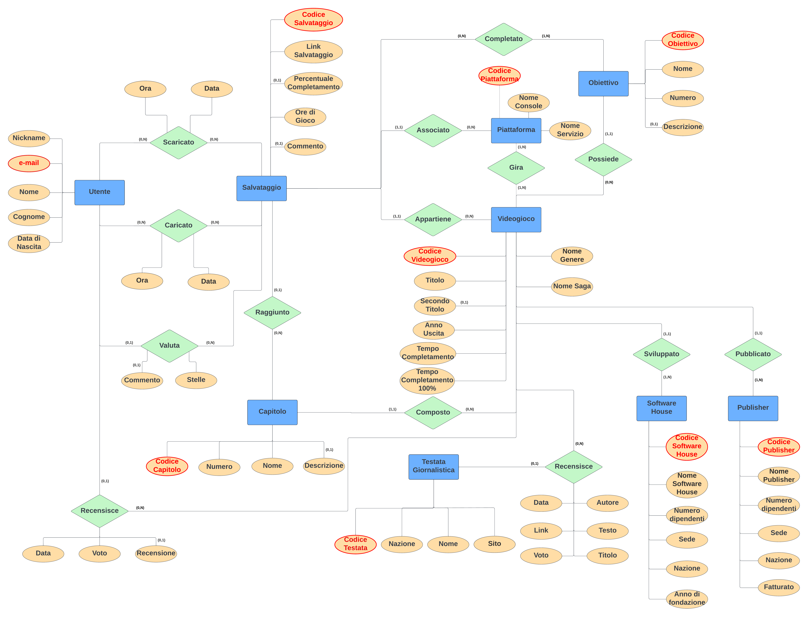
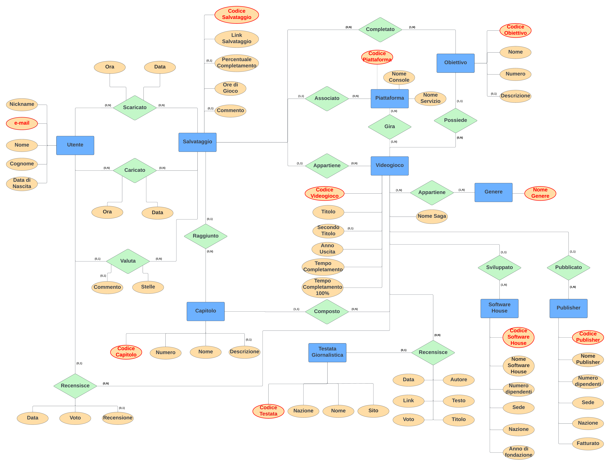
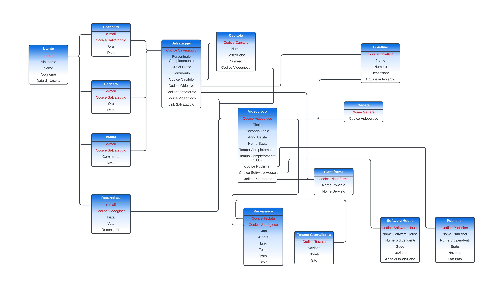

# Progettazione

### Introduzione

Ogni videogiocatore almeno una volta nella vita ha vissuto l'esperienza di perdere i salvataggi di gioco.\
Spesso perché il gioco si chiude in modo improvviso, alcune volte per un bug nel gioco che corrompe il file, a volte per reinstallazione del sistema operativo che fa perdere dati del computer.\
Questo problema viene spesso risolto dai distributori di videogiochi con una sincronizzazione "in Cloud" dei salvataggi di gioco, ma non sempre.

Per questo ho progettato un servizio di condivisione dei salvataggi di gioco dove gli utenti possono condividere e utilizzare liberamente.\
Questo può essere davvero comodo anche per utenti che vogliono andare direttamente a determinate parti del videogioco senza giocarselo tutto, o vogliono rigiocarselo su un'altra piattaforma di gioco ma vogliono andare direttamente ad una parte specifica.

### Requisiti della base di dati

Il salvataggio caricato dall'utente verrebbe salvato in una directory esterna al Database ma verrebbe caricato sul esso solo un collegamento al file.

Dell'*Utente* verrebbe memorizzato *Nickname*, *Nome*, *Cognome*, *Data di Nascita*, *Email*, e *Storico dei Caricamenti* *e degli Scaricamenti*.\
Dei *Salvataggi* si è interessati a conoscere il *Videogioco* in cui appartiene, la *Piattaforma* su cui gira, il *Sistema Operativo*, le *Ore di Gioco* al momento del caricamento e l'*Utente* che l'ha caricato.\
Del *Videogioco* si vuol tener nota dell'*Anno di Uscita*, delle *Recensioni della Critica*, con i relativi *Voti*, delle possibili *Recensioni degli Utenti*, il *Tempo* che serve per finirlo, la *Software House* del gioco e il *Publisher* che lo pubblica.\
Come dato interessante da conoscere dal salvataggio sarebbe la *Percentuale di completamento* del gioco, come anche il *Capitolo* (se presente) in cui si trova il salvataggio, vari *Obiettivi* che variano da gioco a gioco e *Note libere* dell'Utente che ha caricato il salvataggio.\
Verrebbe inserito anche una lista delle *Testate giornalistiche* specializzate più importanti da dove prendere le Recensioni con *Nome della testata*, *Link all'Articolo*, *Autore*.

Le Operazioni sul database che sarebbe interessante implementare sono:

-   upload/download dei file di gioco;

-   sincronizzazione automatica dei salvataggi (in Cloud);

-   ricerca dei salvataggi in base a dei parametri incrociati;

-   recensione degli utenti ai videogiochi;

-   valutazione degli utenti dei salvataggi di gioco;

L'idea è che ci sia un accesso via sito internet dove poter fare login e usufruire dei servizi offerti.

\
\
\

### Glossario dei Termini

| Termine                      | Definizione                                                                               | Sinonimo                                   | Collegamento                    |
|------------------|-------------------|------------------|------------------|
| Salvataggio                  | Dato che salva i progressi di gioco                                                       | file, salvataggio di gioco, dati di gioco  | Utente, Videogioco              |
| Utente                       | Colui che carica e scarica i Salvataggi                                                   | giocatore, player                          | Salvataggio, Videogioco         |
| Videogioco                   | Software con scopo Ludico/Artistico                                                       | gioco, software                            | Salvataggio, Utente, Recensione |
| Piattaforma                  | Servizio software che fornisce il gioco all'Utente                                        | piattaforma di gioco, console, servizio    | Salvataggio, Videogioco         |
| Sistema Operativo            | Sistema Operativo su cui gira il Videogioco                                               | S.O., O.S.                                 | Salvataggio, Videogioco         |
| Tempo di gioco               | Ore che l'utente ha speso sul Videogioco nel momento del Salvataggio                      | ore di gioco, durata di gioco              | Salvataggio                     |
| Testate giornalistiche       | Giornali che recensiscono Videogiochi                                                     | testate videoludiche, giornali videoludici | Videogioco                      |
| Ore medie di Completamento   | Ore che ci vogliono per portare a termine la storia del gioco in media                    | tempo medio di gioco                       | Videogioco                      |
| Software House               | Azienda sviluppatrice del gioco, coloro che hanno programmato il gioco                    |                                            | Videogioco                      |
| Publisher                    | Azienda adibita alla pubblicazione, alla pubblicità, che ha finanziato il progetto        |                                            | Videogioco                      |
| Percentuale di completamento | In certi giochi viene inserita una percentuale della progressione nel gioco               |                                            | Videogioco, Salvataggio         |
| Obiettivi                    | In certi giochi vengono inseriti degli obbiettivi che il giocatore deve portare a termine |                                            | Videogioco, Salvataggio         |

### Suddivisione del testo in frasi omogenee

##### Frasi sugli Utenti

"Dell'*Utente* verrebbe memorizzato *Nickname*, *Nome*, *Cognome*, *Data di Nascita*, *Email*, e *Storico dei Caricamenti* *e degli Scaricamenti*."

##### Frasi sui Salvataggi

"Dei *Salvataggi* si è interessati a conoscere il *Videogioco* in cui appartiene, la *Piattaforma* su cui gira, il *Sistema Operativo*, le *Ore di Gioco* al momento del caricamento e l'*Utente* che l'ha caricato."

"Come dato interessante da conoscere dal salvataggio sarebbe la *Percentuale di completamento* del gioco, come anche il *Capitolo* (se presente) in cui si trova il salvataggio, vari *Obbiettivi* che variano da gioco a gioco e *Note libere* dell'Utente che ha caricato il salvataggio."

##### Frasi sul Videogioco

"Del *Videogioco* si vuol tener nota dell'*Anno di Uscita*, delle *Recensioni della Critica*, con i relativi *Voti*, delle possibili *Recensioni degli Utenti*, il *Tempo* che serve per finirlo, la *Software House* del gioco e il *Publisher* che lo pubblica."

##### Frasi su Testate Giornalistiche

"Verrebbe inserito anche una lista delle *Testate giornalistiche* specializzate più importanti da dove prendere le Recensioni con *Nome della testata*, *Link all'Articolo*, *Autore*."

\
\

## Diagramma Entity-Relationship



\
\
\
\
\
\
\


### Dizionario dei dati (Entità)

| Entità                | Descrizione                                              | Attributi                                                                                             | Identificatore        |
|-----------------|-----------------|---------------------|-----------------|
| Utente                | Giocatore possessore del Salvataggio                     | Nickname, e-mail, Nome, Cognome, Data di Nascita                                                      | e-mail                |
| Salvataggio           | Salvataggio dei progressi di gioco                       | Codice Salvataggio, Percentuale Completamento, Ore di Gioco, Commento, Link Salvataggio               | Codice Salvataggio    |
| Videogioco            | Software creato a scopo Ludico/Artistico                 | Codice Videogioco, Titolo, Secondo Titolo, Anno Uscita, Tempo Completamento, Tempo Completamento 100% | Codice Videogioco     |
| Piattaforma           | Dispositivo Software su cui viene eseguito il videogioco | Codice Piattaforma, Nome Console, Nome Servizio                                                       | Codice Piattaforma    |
| Obiettivo             | Missione all'interno del gioco con progressione          | Codice Obiettivo, Nome, Numero, Descrizione                                                           | Codice Obiettivo      |
| Capitolo              | Capitolo in cui la storia è arrivata nel salvataggio     | Codice Capitolo, Numero, Nome, Descrizione                                                            | Codice Capitolo       |
| Testata Giornalistica | Giornale che recensisce criticamente i videogiochi       | Codice Testata, Nazione, Nome, Sito                                                                   | Codice Testata        |
| Software House        | Azienda sviluppatrice di giochi                          | Nome Software House, Numero dipendenti, Sede, Nazione, Anno di Fondazione                             | Codice Software House |
| Publisher             | Azienda che pubblica i giochi e li distribuisce          | Codice Publisher, Nome Publisher, Numero dipendenti, Sede, Nazione, Fatturato                         | Codice Publisher      |

### Dizionario dei dati (Relazione)

| Relazione  | Descrizione                                        | Componenti                        | Attributi                               |
|------------------|-------------------|------------------|------------------|
| Scaricato  | Salvataggi scaricati da Utenti                     | Utente, Salvataggio               | Ora, Data                               |
| Caricato   | un Salvataggio caricato da un Utente               | Utente, Salvataggio               | Ora, Data                               |
| Recensisce | un Utente recensisce un Videogioco                 | Utente, Videogioco                | Data, Voto, Recensione                  |
| Valuta     | una Valutazione della qualità del Salvataggio      | Utente, Salvataggio               | Commento, Stelle                        |
| Raggiunto  | Raggiungimento di alcuni Obiettivi nel Salvataggio | Salvataggio, Capitolo             |                                         |
| Completato | Capitolo, o Livello, di gioco raggiunto            | Salvataggio, Obiettivo            |                                         |
| Associato  | La Piattaforma su cui il Salvataggio è stato fatto | Salvataggio, Piattaforma          |                                         |
| Appartiene | Videogioco a cui appartiene il Salvataggio         | Salvataggio, Videogioco           |                                         |
| Composto   | Numero di Capitoli in cui è composto il Videogioco | Capitolo, Videogioco              |                                         |
| Gira       | le Piattaforme su cui gira il Videogioco           | Piattaforma, Videogioco           |                                         |
| Possiede   | gli Obiettivi che possiede un Videogioco           | Videogioco, Obiettivo             |                                         |
| Sviluppato | Videogioco sviluppato da una Software House        | Videogioco, Software House        |                                         |
| Pubblicato | Videogioco pubblicato da un Publisher              | Videogioco, Publisher             |                                         |
| Recensisce | una Testata Giornalistica recensisce un Videogioco | Videogioco, Testata Giornalistica | Data, Autore, Link, Testo, Voto, Titolo |

### Vincoli non esprimibili graficamente

Un Salvataggio non può avere una piattaforma che non è nel gioco associato ad esso.

### Considerazioni generali

Si osserva che l'attributo Nome Genere relativo a Videogioco è un attributo multivalore perché il Videogioco potrebbe appartenere a più Generi.

## Tabella dei Volumi

Suppongo che il servizio abbia 40000 Videogiochi registrati nel Database, stima realistica considerando che su Steam (il principale distributore di giochi su PC) sono presenti più di 40000 Videogiochi.

Si considera poi 10000 utenti iscritti al sito e 100000 Salvataggi.

Si stima una media di 10000 caricamenti di Salvataggi all'anno e 5000 scaricamenti di salvataggi all'anno.

Ogni Videogioco ha ipoteticamente 5 recensioni di Testate Giornalistiche, che portano al numero totale di recensioni a 100000.

| Concetto                           | Tipo | Volume             |
|------------------------------------|------|--------------------|
| Utente                             | E    | 10000              |
| Salvataggio                        | E    | 100000             |
| Videogioco                         | E    | 40000              |
| Testata Giornalistica              | E    | 30                 |
| Piattaforma                        | E    | 20                 |
| Obiettivo                          | E    | 160000 (=40000x4)  |
| Capitolo                           | E    | 600000 (=40000x15) |
| Software House                     | E    | 500                |
| Publisher                          | E    | 100                |
| Recensisce [Utente]                | R    | 30000              |
| Recensisce [Testata Giornalistica] | R    | 200000 (=40000x5)  |
| Caricato                           | R    | 100000             |
| Scaricato                          | R    | 50000              |

\
\

### Operazioni di Interesse

| Operazione                                                      | Tipo        | Frequenza  |
|-------------------------------------|------------------|------------------|
| Trova tutti i Salvataggi di un determinato Videogioco           | Interattiva | 100/giorno |
| Controlla lo Storico di Caricamenti e Scaricamenti di un Utente | Interattiva | 10/giorno  |
| Consulta le Recensioni delle Testate Giornalistiche di un Gioco | Interattiva | 100/giorno |
| Carica il Salvataggio nel Database                              | Interattiva | 30/giorno  |
| Calcolo della media dei Voti delle Recensioni                   | Batch       | 1/mese     |

### Analisi delle Ridondanze

Nello schema non sono presenti ridondanze, perché non ci sono informazioni derivanti da altre e non si vede la necessità di inserirne per velocizzare il processo di caricamento dei dati in lettura.

### Partizionamento di Entità

Si osserva che nessuna entità presenta degli attributi che si riferiscono a concetti diversi o che necessitano di un accesso separato, perciò non sembra opportuno fare alcun tipo di partizionamento di entità.

### Eliminare Attributi Multivalore

Nello schema è presente un attributo multivalore, Nome Genere, con cardinalità **(1,N)**, di conseguenza si decide di eliminare tale attributo e creare una nuova entità Genere, questa entità sarà collegata tramite una relazione Genere all'entità Videogioco.

Inoltre si osserva che sono presenti numerosi attributi con cardinalità **(0,1)**, ciò indica che tale attributo può ammettere valore nullo.

## Diagramma Entità-Relazione Ristrutturato



### Scelta degli Identificatori Primari

-   **Utente**: si decide di utilizzare come identificatore l'attributo "e-mail";

-   **Salvataggio**: si decide di utilizzare come identificatore l'attributo "Codice Salvataggio";

-   **Videogioco**: si decide di utilizzare come identificatore l'attributo "Codice Videogioco";

-   **Obiettivo**: si decide di utilizzare come identificatore l'attributo "Codice Obiettivo";

-   **Piattaforma**: si decide di utilizzare come identificatore l'attributo "Codice Piattaforma";

-   **Capitolo**: si decide di utilizzare come identificatore l'attributo "Codice Capitolo";

-   **Testata Giornalistica**: si decide di utilizzare come identificatore l'attributo "Codice Testata";

-   **Software House**: si decide di utilizzare come identificatore l'attributo "Codice Software House";

-   **Publisher**: si decide di utilizzare come identificatore l'attributo "Codice Publisher";

-   **Genere**: si decide di utilizzare come identificatore l'attributo "Nome Genere";

## Passaggio al Modello Razionale

Si individuano le seguenti relazioni, identificatori e attributi per lo schema logico con il modello razionale:

-   Utente(**e-mail**, Nickname, Nome, Cognome, Data di Nascita);

-   Salvataggio(**Codice Salvataggio**, Percentuale Completamento, Ore di Gioco, Commento, Codice Capitolo, Codice Obiettivo, Codice Piattaforma, Codice Videogioco, Link Salvataggio);

-   Videogioco(**Codice Videogioco**, Titolo, Secondo Titolo, Anno Uscita, Nome Saga, Tempo Completamento, Tempo Completamento 100%, Codice Piattaforma, Codice Publisher, Codice Software House);

-   Obiettivo(**Codice Obiettivo**, Nome , Numero, Descrizione, Codice Videogioco);

-   Piattaforma(**Codice Piattaforma**, Nome Console, Nome Servizio);

-   Capitolo(**Codice Capitolo**, Numero, Nome, Descrizione, Codice Videogioco);

-   Testata Giornalistica(**Codice Testata**, Nazione, Nome, Sito);

-   Software House(**Codice Software House**, Nome Software House, Numero dipendenti, Sede, Nazione, Anno di fondazione);

-   Publisher(**Codice Publisher**, Nome Publisher, Numero dipendenti, Sede, Nazione, Fatturato);

-   Genere(**Nome Genere**, Codice Videogioco);

-   Scaricato(**e-mail**, **Codice Salvataggio**, Ora, Data);

-   Caricato(**e-mail**, **Codice Salvataggio**, Ora, Data);

-   Valuta(**e-mail**, **Codice Salvataggio**, Commento, Stelle);

-   Recensisce(**e-mail**, **Codice Videogioco**, Data, Voto, Recensione);

-   Recensisce(**Codice Testata**, **Codice Videogioco**, Data, Autore, Link, Testo, Voto, Titolo);

## Schema Logico



### Normalizzazione

SI nota che lo schema logica rispetta le tre forme normali.

La prima forma normale viene rispettata dopo che è stata creata l'entità Genere che rimuove i campi multipli.

La seconda forma normale viene rispettata perché ciascuna colonna dipende in senso stretto dalla chiave primaria.

La terza forma normale viene rispettata perché nello schema logico non sono presenti attributi che dipendono da altro oltre la chiave primaria.

## Realizzazione delle Operazioni

Le operazioni che verranno presentate sono tutte fatte attraverso una stored procedure, che sono sicure da attacchi di SQL injection.

-   **Operazione 1:**

    "Ricercare il Salvataggio desiderato dal gioco corretto"

    ```{SQL}
    DELIMITER $$
    CREATE PROCEDURE trova.salvataggio(nomeGioco varchar(50))
    BEGIN
      SELECT PercentualeCompletamento, OreDiGioco, Capitolo.Nome, Obiettivo.Nome, Obiettivo.Numero, Piattaforma.NomeConsole, Piattaforma.NomeServizio  
      FROM Salvataggio
      INNER JOIN Videgioco
      ON Videogioco.CodiceVideogioco = Salvataggio.CodiceVideogioco
      INNER JOIN Capitolo
      ON Capitolo.CodiceCapitolo = Salvataggio.CodiceSalvataggio
      INNER JOIN Obiettivo
      ON Obiettivo.CodiceObiettivo = Salvataggio.CodiceObiettivo
      INNER JOIN Piattaforma
      ON Piattaforma.CodicePiattaforma = Piattaforma.CodicePiattaforma
      WHERE Videogioco.Titolo = nomeGioco;
      ORDER BY Videogioco.Titolo DESC;
    END $$
    DELIMITER;
    ```

-   **Operazione 2:**

    "Ottenere il link da cui scaricare il Salvataggio attraverso una ricerca incrociata"

    ```{SQL}
    DELIMITER $$
    CREATE PROCEDURE trova.link(nomeGioco varchar(50), oreGioco INT, nomeServizio varchar(50))
    BEGIN
      SELECT LinkSalvataggio 
      FROM Salvataggio
      INNER JOIN Videogioco
      ON Videogioco.CodiceVideogioco = Salvataggio.CodiceVideogioco
      INNER JOIN Piattaforma
      ON Piattaforma.CodicePiattaforma = Salvataggio.CodicePiattaforma
      WHERE Videogioco.Titolo = nomeGioco
      AND Salvataggio.OreDiGioco = oreGioco
      AND Piattaforma.NomeServizio = nomeServizio;
    END $$
    DELIMITER;
    ```

-   **Operazione 3:**

    "Sapere quanti Salvataggi sono stati caricati e scaricati da un singolo Utente"

    ```{SQL}
    DELIMITER $$
    CREATE PROCEDURE salvataggi.caricoscarico(nomeUtente varchar(50))
    BEGIN
      (SELECT count(*)
      FROM Scaricato
      INNER JOIN Utente
      ON Utente.email = Scaricato.email
      WHERE Utente.Nickname = nomeUtente)
      AND
      (SELECT count(*)
      FROM Caricato
      INNER JOIN Utente
      ON Utente.email = Caricato.email
      WHERE Utente.Nickname = nomeUtente)
    END $$
    DELIMITER;
    ```

-   **Operazione 4:**

    "Visualizzare i Voti e la Recensione dati dalle Testate Giornalistiche dato il Titolo del Videogioco"

    ```{SQL}
    DELIMITER $$
    CREATE PROCEDURE voti.critica(nomeGioco varchar(50))
    BEGIN
      SELECT TestataGiornalistica.Nome, Voto, Testo
      FROM TestataRecensisce
      INNER JOIN Videogioco
      ON Videogioco.CodiceVideogioco = TestataRecensisce.CodiceVideogioco
      INNER JOIN TestataGiornalistica
      ON TestataGiornalistica.CodiceTestata = TestataRecensione.CodiceTestata
      WHERE Videogioco.Titolo = nomeGioco
    END $$
    DELIMITER;
    ```
